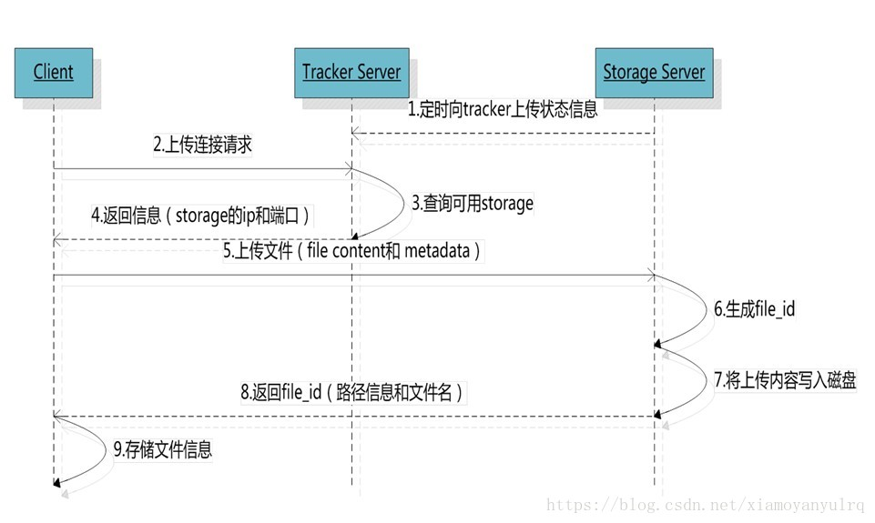

你好，我叫 张奇，之前一直从事python开发工作，我近期做了一个在线教育项目，使用django+vue，（有用户（会员）、课程、论坛、线下公开课），我负责的是课程模块，在课程添加的时候要添加图片，考虑到后期图片还有课程章节的视频资源会很多，所以使用专门的服务器搭建**FastDFS**分布式文件系统，存储这些资源。

然后在课程展示时使用了redis缓存这一页的数据，因为展示页面，向产品的名称、图片等数据是热点数据，是会被频繁访问的，所以使用**redis**做缓存，避免频繁访问MySQL数据库，造成数据库压力过大。

在课程详情页面用户可以看到课程的学习人数，关注人数，讲师信息，课程章节信息，课程评论，学习笔记，课程问答

学习人数，关注人数，是放在redis之中每天晚上凌晨定时写入数据库，然后用户看课程的时候，可以一边看课程，一边**在线编程**。

#### fsatDFS是什么

fastrDFS是一个开源的轻量级分布式文件存储系统，由追踪服务器（tracker）、存储服务器（storage）和客户端（client）三部分组成，主要是解决海量数据存储问题，特别是适合以中小文件为载体的在线服务。

fsatDFS原理  

 

FastDFS使用过程中遇到了哪些问题

#### redis

redis是开源的非关系型的key-value存储内存数据库，它支持丰富的数据结构，

常用的有string类型经常被用到，向这个项目中的课程浏览量、学习人数就是使用string类型；

list类型一般被用作消息队列或是排行榜之类的，向这个项目中的最热课程（前10）排行，就是使用这个类型；

hash类型一般存储对象，向课程购买订单信息，在客户未支付之前存在redis中，等客户支付完成之后，取出存入MySQL中；如果客户在预定时间未支付则将信息存入未支付的表中，并给客户发送消息提醒支付。此信息保存7天，7天后失效 ，每天凌晨跑定时任务清理。

redis集群

​		哨兵模式

redis持久化

​		RDB(快照)、AOF

在线编程

xterm
前端通过 xterm 插件进行 shell 黑窗口环境的搭建，这个插件会自动解析由后台 paramiko 返回的带有标记样式的命令结果，并渲染到浏览器中，非常酷炫
websocket
这里通过 **websocket** 进行浏览器与 django 的数据交通桥梁
**paramiko** 
paramiko 此时的角色用来承担 django 与 Linux 环境的交互，将前端发来的命令发送给后台，将后台发来的命令结果返回到前端的 xterm 组件中
当浏览器关闭时，也代表着客户端关闭，此时主动断开连接，交给 vue 的钩子函数来处理这个问题

websocket

WebSocket 是 HTML5 开始提供的一种在单个 TCP 连接上进行全双工通讯的协议。

WebSocket 使得客户端和服务器之间的数据交换变得更加简单，允许服务端主动向客户端推送数据。

 浏览器和服务器只需要做一个握手的动作，然后，浏览器和服务器之间就形成了一条快速通道。两者之间就直接可以数据互相传送。 

  WebSocket 协议，能更好的节省服务器资源和带宽，并且能够更实时地进行通讯。 

 Websocket 使用 ws 或 wss 的统一资源标志符，类似于 HTTP和HTTPS

 paramiko模块，基于SSH用于连接远程服务器并执行相关操作。 

