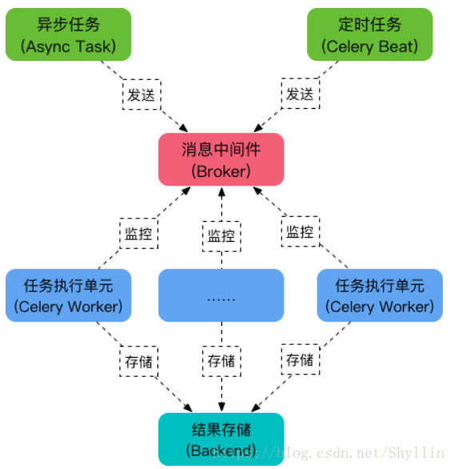

# Celery

## 简介

 Celery 是一个由 Python 编写的用来处理大量信息的分布式 队列管理工具 .

Celery 是一个专注于实时处理和任务调度的分布式任务队列, 同时提供操作和维护分布式系统所需的工具.

Celery 是一个分布式队列的管理工具, 可以用 Celery 提供的接口快速实现并管理一个分布式的任务队列.

Celery 本身不是任务队列, 是管理分布式任务队列的工具. 它封装了操作常见任务队列的各种操作, 我们使用它可以快速进行任务队列的使用与管理.

## 主要特性

​	1.方便查询任务的进展情况，如执行结果，状态，消耗时间。

​	2.可以利用功能齐全的后台管理进行任务的添加，删减等操作。

​	3.可以进行并发操作。

​	4.提供异常处理机制。

## 主要架构




可以看到，Celery 主要包含以下几个模块：

- 任务模块 Task

  包含异步任务和定时任务。其中，**异步任务通常在业务逻辑中被触发并发往任务队列，而定时任务由 Celery Beat 进程周期性地将任务发往任务队列**。

- 消息中间件 Broker

  Broker，即为任务调度队列，**接收任务生产者发来的消息（即任务），将任务存入队列**。Celery 本身不提供队列服务，官方推荐使用 RabbitMQ 和 [Redis](http://lib.csdn.net/base/redis) 等。

- 任务执行单元 Worker

  Worker 是执行任务的处理单元，**它实时监控消息队列，获取队列中调度的任务，并执行它**。

- 任务结果存储 Backend

  Backend 用于**存储任务的执行结果**，以供查询。同消息中间件一样，存储也可使用 RabbitMQ, [redis](http://lib.csdn.net/base/redis) 和 [MongoDB](http://lib.csdn.net/base/mongodb) 等。


## 消息代理

Celery 本身不是任务队列, 是管理分布式任务队列的工具. 它封装了操作常见任务队列的各种操作, 我们使用它可以快速进行任务队列的使用与管理.

RabbitMQ (消息队列)，[Redis](http://lib.csdn.net/base/redis)（缓存数据库），[数据库](http://lib.csdn.net/base/mysql)（不推荐）

## redis发布订阅模式用做消息队列和rabbitmq的区别：

#### 可靠性

​    redis ：没有相应的机制保证消息的可靠消费，如果发布者发布一条消息，而没有对应的订阅者的话，这条消息将丢失，不会存在内存中；
​    rabbitmq：具有消息消费确认机制，如果发布一条消息，还没有消费者消费该队列，那么这条消息将一直存放在队列中，直到有消费者消费了该条消息，以此可以保证消息的可靠消费，那么rabbitmq的消息是如何存储的呢？（后续更新）；

#### 实时性

​    redis:实时性高，redis作为高效的缓存服务器，所有数据都存在内存中，所以它具有更高的实时性

#### 消费者负载均衡：

​    rabbitmq队列可以被多个消费者同时监控消费，但是每一条消息只能被消费一次，由于rabbitmq的消费确认机制，因此它能够根据消费者的消费能力而调整它的负载；
​    redis发布订阅模式，一个队列可以被多个消费者同时订阅，当有消息到达时，会将该消息依次发送给每个订阅者，她是一种消息的广播形式，redis本身不做消费者的负载均衡，因此消费效率存在瓶颈；

#### 持久性

​    redis：redis的持久化是针对于整个redis缓存的内容，它有RDB和AOF两种持久化方式（redis持久化方式，后续更新），可以将整个redis实例持久化到磁盘，以此来做数据备份，防止异常情况下导致数据丢失。
​    rabbitmq：队列，每条消息都可以选择性持久化，持久化粒度更小，更灵活；

#### 队列监控

​    rabbitmq实现了后台监控平台，可以在该平台上看到所有创建的队列的详细情况，良好的后台管理平台可以方面我们更好的使用；
​    redis没有所谓的监控平台。

## 主要应用场景

web应用，当需要触发事件需要较长时间处理完成，可以交给celery进行异步执行，执行完后返回结果，这段时间不用等待，提高系统的吞吐量和响应时间。

异步任务：发送邮件、提示消息、文件上传、图像处理、清理/删除缓存、给客户发送生日祝福等等

## 项目应用

实验楼的秒杀模块使用到了Celery的定时任务，每天的凌晨0点跑一次，查看当天是否有秒杀场次，有则将秒杀页面用的信息从数据库取出，缓存到redis中。

```
# task.py

from celery import Celery
import time 

# broker和backend都设置为redis
my_task = Celery('task',broker='redis://127.0.0.1:6379/1',
    backend='redis://127.0.0.1:6379/2')

# 任务执行单元
@my_task.task
def func1(x,y):
    time.sleep(10)
    return x + y
```

```
# handle.py
from task import func1

res = func1.delay(2,4)   #  用delay去向执行单元派送任务并传参
print(res.id)
```

 		运行worker 

```
celery worker -A task -l INFO

# -A 指定worker所在的Celery app的文件名，就是task
# -l   是日志打印的级别
# -c 10 可以同时开启10个worker处理 
```

```
# handle.py
python3 handle.py
```

## 使用问题

### 在Django中使用celery内存泄漏问题？ 

　　 在django下使用celery作为异步任务系统，十分方便。

 　　同时celery也提供定时任务机制，celery beat。使用celery beat 可以为我们提供 cron，schedule 形式的定时任务。

 　　在django下使用celery beat的过程中，发现了 celery beat进程 占用内存非常大，而且一直不释放。

 　　怀疑其有内存占用不释放的可能。

 　　因为之前使用django的时候，就知道在django中开启DEBUG模式，会为每次的SQL查询 缓存结果。  celery beat 作为 定时任务的timer和heartbeat程序，是长期运行的，而我使用了MYSQL作为存储定时任务的backend。

　　 因为每次heartbeat和timer产生的sql查询在开启了DEBUG模式下的django环境中，都会缓存查询结果集。因此 celery beat占用的 内存会一直不释放。在我的线上环境中 达到10G内存占用！

   　 解决： 关掉django的DEBUG模式，在setting中，设置DEBUG=False 即可。  关闭DEBUG模式后的celery beat程序 的内存占用大概 一直维持在150M左右。