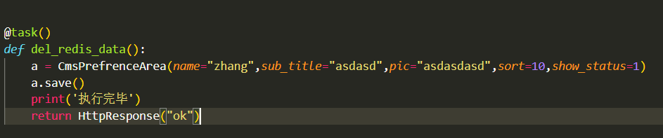

完成django定时任务除了celery还可以用django-crontab实现,有兴趣的可以在百度上看一下.

Celery是Python的第三方库，它可以用于任何的Python的项目中

Celery 是一个强大的分布式任务队列，它可以让任务的执行完全脱离主程序，甚至可以被分配到其他主机上运行.

我们可以用它来实现异步任务与定时任务;

异步任务比如是发送邮件、或者文件上传、图像处理、发送消息、推送消息、清除/设置缓存、给客户发送祝福等等一些比较耗时的操作 

定时任务是需要在特定时间执行的任务。

流程图如下,有兴趣可以看一下:


Celery的架构由三部分组成，消息中间件（message broker），任务执行单元（worker）和任务执行结果存储（task result store）组成。

任务队列 Task :

任务队列是一种跨线程、跨机器工作的一种机制.

任务队列中包含称作任务的工作单元。有专门的工作进程持续不断的监视任务队列，并从中获得新的任务并处理.

任务模块Beat  :

包含异步任务和定时任务。其中，异步任务通常在业务逻辑中被触发并发往任务队列，而定时任务由 Celery Beat 进程周期性地将任务发往任务队列。

消息中间件 Broker :

Broker ，即为任务调度队列，接收任务生产者发来的消息（即任务），将任务存入队列。 Celery 本身不提供队列服务，官方推荐使用 RabbitMQ 和 Redis 等。

任务执行单元 Worker   :

Worker 是执行任务的处理单元，它实时监控消息队列，获取队列中调度的任务，并执行它。 

任务结果存储 Backend    :

Backend 用于存储任务的执行结果，以供查询。同消息中间件一样，存储也可使用 RabbitMQ, Redis 和 MongoDB 等。


下面给大家介绍一下定时任务在Django中的配置与使用

首先,你需要在黑窗口下载以下扩展:

```
pip install celery

pip install celery-with-redis

pip install django-celery
```

下好之后,进入你的主文件的settings.py文件中,加入最后一个


在setting.py的结尾处，加入celery参数配置,这个selery可以提出来,单独做一个文件.

```
import djcelery

djcelery.setup_loader()  #设置载入程序

BROKER_URL = 'redis://127.0.0.1:6379/6'  #代理人路由,它负责分发任务给worker去执行,我们这用Redis作为broker(代理人)

CELERY_IMPORTS = ('api.tasks')    #导入的文件

CELERY_TIMEZONE = TIME_ZONE    #时区

# 使用了django-celery默认的数据库调度模型,任务执行周期都被存在默认指定的orm数据库中

CELERYBEAT_SCHEDULER = 'djcelery.schedulers.DatabaseScheduler' 
```

在这里给他定义一个时间任务,它会每隔一个固定时间周期去执行一次相应的task，比如隔1分钟，是周期性任务

```
from celery.schedules import crontab

CELERYBEAT_SCHEDULE = {

  #定时任务一：　每一分钟执行一次任务(del_redis_data)

      u'定义一个任务名为:del_redis_data': {

        "task": "app.tasks.del_redis_data",

        # "schedule": crontab(hour='/1'),

        "schedule": crontab(minute=1),

        "args": (),

},

}
```

minute(分钟)hour(小时,钟头)dat_for_month('1')(每月的第几天)

这些都可以套用,比如:

每月1号的6点启动

```
'schedule': crontab(hour=6, minute=0, day_of_month='1'), 
```

配置好settings之后,在你的文件目录下创建新文件夹task


可以在这里面定义你的任务,比如我定义了一个入库的任务,每分钟执行一次,这里他用装饰器@task(),可以看一下settings中定义的任务名为:del_redis_data,这里的函数也是del_redis_data,这里与settings最好一致,



当你写完这些,你就可以启动定时任务了

启动终端,切换到Django项目的根目录下，运行

启动web服务

```
python manage.py runserver 
```

然后 :

启动 celery woker

```
python manage.py celery worker -l info 
```

最后 : 

启动beat, 执行定时任务

```
celery beat -A 项目名 -l info.
```

