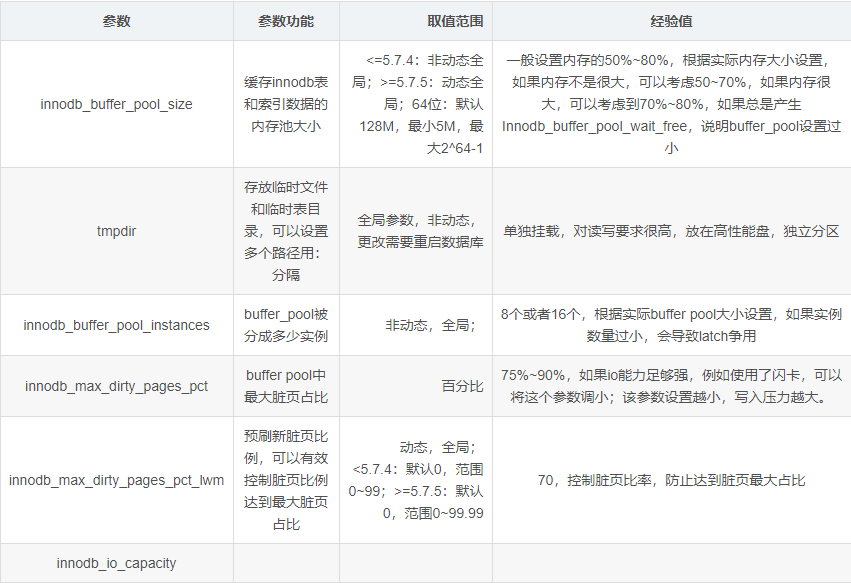
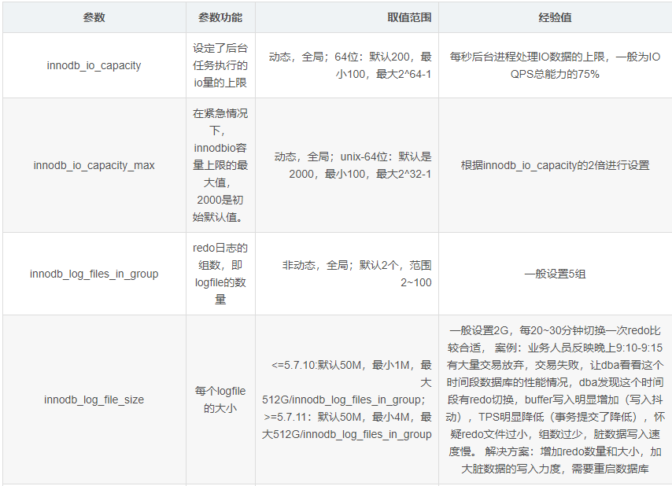
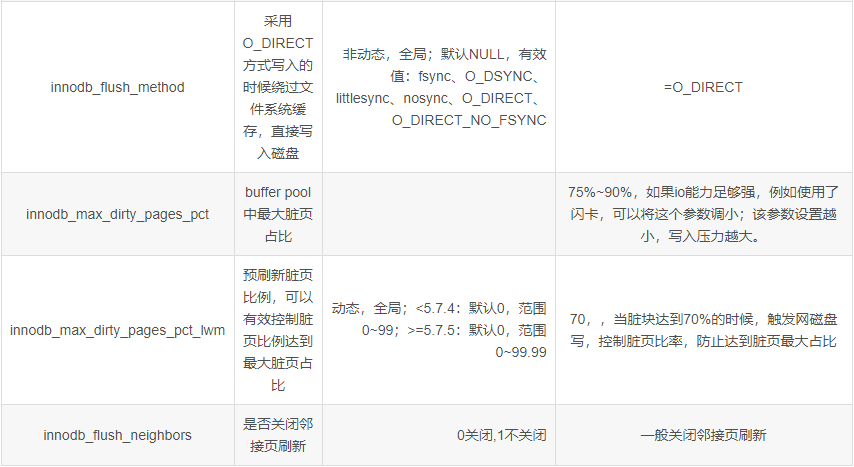
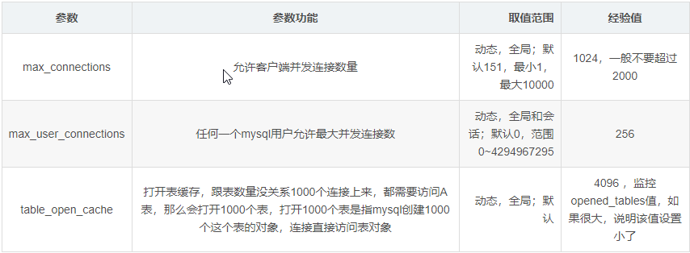

## cpu优化

|           参数            | 参数功能                                                     | 取值范围 | 经验值                 |
| :-----------------------: | ------------------------------------------------------------ | -------- | ---------------------- |
| innodb_thread_concurrency | 并发执行的线程的数量（同时干活的线程的数量），保护系统不被hang住 | 0-1000   | 一般要求是cpu核数的4倍 |

## 内存优化

 

## io优化

 

 

 

## 连接的优化

 

 

```
thread_cache_size=512
```

都是短连接进来容易产生短连接风暴

会话层：事务状态、认证会话

连接层：网络连接、包传输

一个用户 对应 一个session 对应 一个connection

connection - thread:操作系统调用

3000个用户进来使用cache的512个线程，用完就放回去，避免创建、销毁线程的开销

 

```
wait_timeout=120
```


指的是app应用连接mysql进行操作完毕后，空闲120秒后断开

 

数据一致性优化

```
innodb_flush_log_at_trx_commit=1
```

 

0，不管有没有提交，每秒钟都写到binlog日志里

1，每次提交事务，都会把log buffer的内容写到磁盘里去，对日志文件做到磁盘刷新，安全最好

2，每次提交事务，都写到操作系统缓存，由OS刷新到磁盘，性能最好

 

```
sync_binlog=1
```

 

0，事务提交后，mysql不做fsync之类的刷盘，由文件系统来决定什么落盘

n，多少次提交，每n次提交持久化磁盘

生产设为1

 

日志写盘过程

image

 

1)三个update会话，三个线程都会产生的操作日志

2 )commit后提交到公共的cache中，三个进程之间不能相互看到对方的操作内容

3)经过write写入到标准I/O cache中，也就是文件系统句柄，线程缓存

4)如果需要让其他线程看到文件句柄内容，就需要通过flush刷新到全局可见文件系统缓存

5)最后最重的一步是将内存数据sync落盘