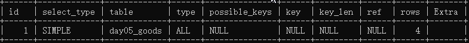
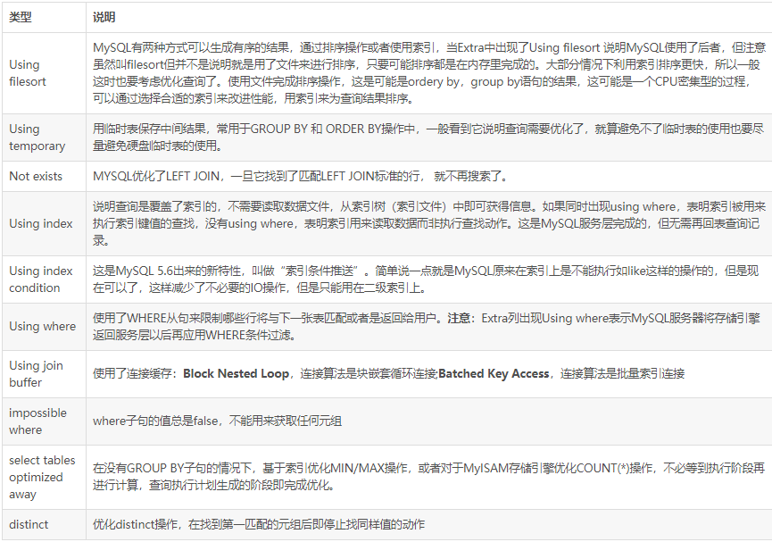

执行计划是数据库根据SQL语句和相关表的统计信息作出的一个查询方案，这个方案是由查询优化器自动分析产生的。

使用explain关键字可以模拟优化器执行SQL查询语句，从而知道MySQL是如何处理你的SQL语句的，分析你的select 语句或是表结构的性能瓶颈，让我们知道select 效率低下的原因，从而改进我们的查询。

使用方法，在select语句前加上explain就可以了。

```
explain select * from day05_goods;
```

 

下面是有关各列的详细介绍，重要的有id、type、key、rows、extra。

 

### id：

id列的编号就是select 的序列号，也可以理解为SQL执行顺序的标识，有几个select 就有几个id。

 （1）id值不同：如果是只查询，id的序号会递增，id值越大优先级越高，越先被执行；

 （2）id值相同：从上往下依次执行；

 （3）id列为null：表示这是一个结果集，不需要使用它来进行查询。


### select_type：

查询的类型，主要用于区分普通查询、联合查询、子查询等复杂的查询；

 （1）simple：表示查询中不包括union操作或者子查询，位于最外层的查询的select_type即为simple，且只有一个；

 例子：explain select * from t3 where id=3952602;

 （2）primary：需要union操作或者含有子查询的select，位于最外层的查询的select_type即为primary，且只有一个；

```
 explain select * from (select * from t3 where id=3952602) a ;
```

（3）derived：from列表中出现的子查询，也叫做衍生表；mysql或者递归执行这些子查询，把结果放在临时表里。

 例子：

```
explain select * from (select * from t3 where id=3952602) a ;
```

 （4）subquery：除了from子句中包含的子查询外，其他地方出现的子查询都可能是subquery。

  例子：

```
explain select * from t3 where id = (select id from t3 whereid=3952602 ) ；
```

 （5）union：若第二个select出现在union之后，则被标记为union；若union包含在from子句的子查询中，外层select将被标记为derived。

 例子：

```
explain select * from t3 where id=3952602 union all select * from t3;
```

 （6）union result：从union表获取结果的select ，因为它不需要参与查询，所以id字段为null。

 例子：

```
explain select * from t3 where id=3952602 union all select * from t3;
```

+----+--------------+------------+-------+-------------------+---------+---------+-------+------+-------+

| id | select_type | table   | type |possible_keys   | key   | key_len |ref  | rows | Extra |

+----+--------------+------------+-------+-------------------+---------+---------+-------+------+-------+

| 1 | PRIMARY   | t3    | const | PRIMARY,idx_t3_id | PRIMARY | 4   | const |  1 |    |

| 2 | UNION    | t3    | ALL  | NULL       | NULL  | NULL  | NULL | 1000 |    |

|NULL | UNION RESULT | <union1,2> | ALL  | NULL       | NULL  |NULL  | NULL | NULL |    |

+----+--------------+------------+-------+-------------------+---------+---------+-------+------+-------+

 （7）dependent union：与union一样，出现在union 或union all语句中，但是这个查询要受到外部查询的影响；

 （8）dependent subquery：与dependent union类似，子查询中的第一个SELECT，这个subquery的查询要受到外部表查询的影响。

 

### table：

表示explain 的一行正在访问哪个表。

 （1）如果查询使用了别名，那么这里显示的是别名;

 （2）如果不涉及对数据表的操作，那么这显示为null;

 （3）如果显示为尖括号括起来的<derived N>就表示这个是临时表，后边的N就是执行计划中的id，表示结果来自于这个查询产生;

 （4）如果是尖括号括起来的<union M,N>，与<derived N>类似，也是一个临时表，表示这个结果来自于union查询的id为M,N的结果集。

 

### type：

访问类型，即MySQL决定如何查找表中的行。

 依次从好到差：system > const > eq_ref > ref > fulltext > ref_or_null > index_merge > unique_subquery > index_subquery > range > index > ALL，除了all之外，其他的type都可以使用到索引，除了index_merge之外，其他的type只可以用到一个索引。一般来说，得保证查询至少达到range级别，最好能达到ref。

 （1）system：表中只有一行数据（等于系统表），这是const 类型的特例，平时不会出现，可以忽略不计。 

 （2）const：使用唯一索引或者主键，表示通过索引一次就找到了，const用于比较primary key 或者 unique索引。因为只需匹配一行数据，所有很快。如果将主键置于where列表中，mysql就能将该查询转换为一个const。

 （3）eq_ref：唯一性索引扫描，对于每个索引键，表中只有一行数据与之匹配。常见于主键或唯一索引扫描。

 （4）ref：非唯一性索引扫描，返回匹配某个单独值的所有行。本质也是一种索引。

 （5）fulltext：全文索引检索，全文索引的优先级很高，若全文索引和普通索引同时存在时，mysql不管代价，优先选择使用全文索引。

 （6）ref_or_null：与ref方法类似，只是增加了null值的比较。

 （7）index_merge：表示查询使用了两个以上的索引，索引合并的优化方法，最后取交集或者并集，常见and ，or的条件使用了不同的索引。

 （8）unique_subquery：用于where中的in形式子查询，子查询返回不重复值唯一值；

 （9）index_subquery：用于in形式子查询使用到了辅助索引或者in常数列表，子查询可能返回重复值，可以使用索引将子查询去重。

 （10）range：索引范围扫描，常见于使用>,<,between ,in ,like等运算符的查询中。

 （11）index：索引全表扫描，把索引树从头到尾扫一遍；

 （12）all：遍历全表以找到匹配的行（Index与ALL虽然都是读全表，但index是从索引中读取，而ALL是从硬盘读取）

 （13）NULL: MySQL在优化过程中分解语句，执行时甚至不用访问表或索引。

 

### possible_keys：

 显示查询语句可能用到的索引(一个或多个或为null)，不一定被查询实际使用。

 

### key：

 显示查询实际使用哪个索引来优化对该表的访问；

 select_type为index_merge时，这里可能出现两个以上的索引，其他的select_type这里只会出现一个。

 

### key_len：

用于处理查询的索引长度，表示索引中使用的字节数。通过这个值，可以得出一个多列索引里实际使用了哪一部分。

  注：key_len显示的值为索引字段的最大可能长度，并非实际使用长度，即key_len是根据表定义计算而得，不是通过表内检索出的。另外，key_len只计算where条件用到的索引长度，而排序和分组就算用到了索引，也不会计算到key_len中。

 

### ref：

显示哪个字段或者常数与key一起被使用。

 （1）如果是使用的常数等值查询，这里会显示const。

 （2）如果是连接查询，被驱动表的执行计划这里会显示驱动表的关联字段。

 （3）如果是条件使用了表达式或者函数，或者条件列发生了内部隐式转换，这里可能显示为func。

 

### rows：

根据表统计信息及索引选用情况，大致估算出找到所需的记录所需要读取的行数，值越大越不好。不是精确值。

 

### extra：

不适合在其他列中显示但十分重要的额外信息。

 这个列可以显示的信息非常多，有几十种，常用的有：

 

 

### filtered：

使用explain extended时会出现这个列，5.7之后的版本默认就有这个字段，不需要使用explain extended了。

这个字段表示存储引擎返回的数据在server层过滤后，剩下多少满足查询的记录数量的比例，注意是百分比，不是具体记录数。

一个百分比的值，和rows 列的值一起使用，可以估计出查询执行计划(QEP)中的前一个表的结果集，从而确定join操作的循环次数。小表驱动大表，减轻连接的次数。

 关于MySQL执行计划的局限性：

（1）EXPLAIN不会告诉你关于触发器、存储过程的信息或用户自定义函数对查询的影响情况；

 （2）EXPLAIN不考虑各种Cache；

 （3）EXPLAIN不能显示MySQL在执行查询时所作的优化工作；

 （4）部分统计信息是估算的，并非精确值；

 （5）EXPALIN只能解释SELECT操作，其他操作要重写为SELECT后查看。


####  通过explain的参数介绍，我们可以得知:

1 表的读取顺序(id)
2 数据读取操作的操作类型(type)
3 哪些索引被实际使用(key)
4 表之间的引用(ref)
5 每张表有多少行被优化器查询(rows)