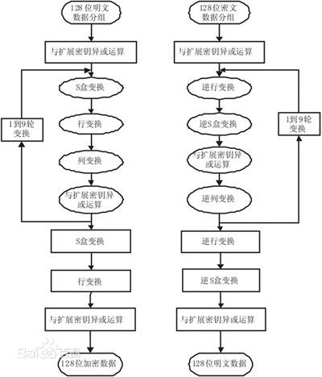

[数据加密](https://baike.baidu.com/item/数据加密/11048982)的基本过程就是对原来为明文的文件或数据按某种[算法](https://baike.baidu.com/item/算法/209025)进行处理，使其成为不可读的一段代码为“密文”，使其只能在输入相应的[密钥](https://baike.baidu.com/item/密钥/101144)之后才能显示出原容，通过这样的途径来达到保护数据不被非法人窃取、阅读的目的。 该过程的逆过程为解密，即将该[编码](https://baike.baidu.com/item/编码/80092)信息转化为其原来数据的过程。

通过修改文件的md5值，可以绕过某些网盘的"违规文件扫描机制"，这是因为网盘服务器内存储着已知违规文件的md5值，当上传文件时会自动与服务器md5数据库匹配以判断是否违规。

  

## 相关简介

据记载，公元前400年，古希腊人发明了置换密码。1881年世界上的第一个电话保密专利出现。在第二次世界大战期间，德国军方启用“恩尼格玛”密码机，[密码学](https://baike.baidu.com/item/密码学/480001)在战争中起着非常重要的作用。

随着信息化和数字化社会的发展，人们对信息安全和保密的重要性认识不断提高，于是在1997年，美国国家标准局公布实施了“美国数据加密标准（DES）”，民间力量开始全面介入密码学的研究和应用中，采用的加密算法有DES、RSA、SHA等。随着对加密强度需求的不断提高，近期又出现了AES、ECC等。

使用密码学可以达到以下目的：

保密性：防止用户的标识或数据被读取。

数据完整性：防止数据被更改。

身份验证：确保数据发自特定的一方。

  

## 分类

[加密技术](https://baike.baidu.com/item/加密技术)通常分为两大类：“对称式”和“非对称式”。

   

### 对称式加密技术

对称式加密就是加密和解密使用同一个[密钥](https://baike.baidu.com/item/密钥)，通常称之为“Session Key ”这种[加密技术](https://baike.baidu.com/item/加密技术)在当今被广泛采用，如美国政府所采用的DES加密标准就是一种典型的“对称式”[加密法](https://baike.baidu.com/item/加密法)，它的Session Key长度为56bits。

   

### 非对称式加密技术

非对称式加密就是加密和解密所使用的不是同一个[密钥](https://baike.baidu.com/item/密钥)，通常有两个密钥，称为“[公钥](https://baike.baidu.com/item/公钥)”和“[私钥](https://baike.baidu.com/item/私钥)”，它们两个必需配对使用，否则不能打开加密文件。这里的“[公钥](https://baike.baidu.com/item/公钥)”是指可以对外公布的，“[私钥](https://baike.baidu.com/item/私钥)”则不能，只能由持有人一个人知道。它的优越性就在这里，因为对称式的加密方法如果是在网络上传输加密文件就很难不把[密钥](https://baike.baidu.com/item/密钥)告诉对方，不管用什么方法都有可能被别[窃听](https://baike.baidu.com/item/窃听)到。而非对称式的加密方法有两个[密钥](https://baike.baidu.com/item/密钥)，且其中的“[公钥](https://baike.baidu.com/item/公钥)”是可以公开的，也就不怕别人知道，收件人解密时只要用自己的[私钥](https://baike.baidu.com/item/私钥)即可以，这样就很好地避免了密钥的传输安全性问题。

## 常见加密算法

[DES](https://baike.baidu.com/item/DES)（Data Encryption Standard）：[对称算法](https://baike.baidu.com/item/对称算法)，[数据加密标准](https://baike.baidu.com/item/数据加密标准)，速度较快，适用于加密大量数据的场合；

[3DES](https://baike.baidu.com/item/3DES)（Triple DES）：是基于DES的[对称算法](https://baike.baidu.com/item/对称算法)，对一块数据用三个不同的[密钥](https://baike.baidu.com/item/密钥)进行三次加密，强度更高；

[RC2](https://baike.baidu.com/item/RC2)和[RC4](https://baike.baidu.com/item/RC4)：[对称算法](https://baike.baidu.com/item/对称算法)，用变长[密钥](https://baike.baidu.com/item/密钥)对大量数据进行加密，比 DES 快；

[IDEA](https://baike.baidu.com/item/IDEA)（International Data Encryption Algorithm）[国际数据加密算法](https://baike.baidu.com/item/国际数据加密算法)，使用 128 位[密钥](https://baike.baidu.com/item/密钥)提供非常强的安全性；

[RSA](https://baike.baidu.com/item/RSA)：由 RSA 公司发明，是一个支持变长[密钥](https://baike.baidu.com/item/密钥)的公共密钥[算法](https://baike.baidu.com/item/算法)，需要加密的文件块的长度也是可变的，[非对称算法](https://baike.baidu.com/item/非对称算法)； 算法如下：

首先, 找出三个数, p, q, r,
　　其中 p, q 是两个不相同的质数, r 是与 (p-1)(q-1) 互为质数的数。
　　p, q, r 这三个数便是 private key。

接着, 找出 m, 使得 rm == 1 mod (p-1)(q-1).....
　　这个 m 一定存在, 因为 r 与 (p-1)(q-1) 互质, 用辗转相除法就可以得到了。
　　再来, 计算 n = pq.......
　　m, n 这两个数便是 public key

[DSA](https://baike.baidu.com/item/DSA)（Digital Signature Algorithm）：[数字签名](https://baike.baidu.com/item/数字签名)[算法](https://baike.baidu.com/item/算法)，是一种标准的 DSS（[数字签名标准](https://baike.baidu.com/item/数字签名标准)），严格来说不算加密算法；

[AES](https://baike.baidu.com/item/AES)（Advanced Encryption Standard）：[高级加密标准](https://baike.baidu.com/item/高级加密标准)，[对称算法](https://baike.baidu.com/item/对称算法)，是下一代的加密算法标准，速度快，安全级别高，在21世纪AES 标准的一个实现是 Rijndael 算法。 [4] 

[BLOWFISH](https://baike.baidu.com/item/BLOWFISH)，它使用变长的[密钥](https://baike.baidu.com/item/密钥)，长度可达448位，运行速度很快；

MD5：严格来说不算加密[算法](https://baike.baidu.com/item/算法)，只能说是摘要算法；

对[MD5算法](https://baike.baidu.com/item/MD5算法)简要的叙述可以为：MD5以512位分组来处理输入的信息，且每一分组又被划分为16个32位子分组，经过了一系列的处理后，算法的输出由四个32位分组组成，将这四个32位分组级联后将生成一个128位散列值。

在[MD5算法](https://baike.baidu.com/item/MD5算法/174909)中，首先需要对信息进行填充，使其字节长度对512求余的结果等于448。因此，信息的字节长度（Bits  Length）将被扩展至N*512+448，即N*64+56个字节（Bytes），N为一个正整数。填充的方法如下，在信息的后面填充一个1和无数个0，直到满足上面的条件时才停止用0对信息的填充。然后，在这个结果后面附加一个以64位二进制表示的填充前信息长度。经过这两步的处理，如今信息字节长度=N*512+448+64=(N+1)*512，即长度恰好是512的整数倍。这样做的原因是为满足后面处理中对信息长度的要求。（可参见[MD5算法](https://baike.baidu.com/item/MD5算法/174909)词条）

[PKCS](https://baike.baidu.com/item/PKCS/1042350):The Public-Key Cryptography Standards (PKCS)是由美国RSA数据安全公司及其合作伙伴制定的一组公钥密码学标准，其中包括证书申请、证书更新、证书作废表发布、扩展证书内容以及[数字签名](https://baike.baidu.com/item/数字签名)、[数字信封](https://baike.baidu.com/item/数字信封)的格式等方面的一系列相关协议。

SSF33，SSF28，SCB2(SM1)：国家密码局的隐蔽不公开的商用[算法](https://baike.baidu.com/item/算法)，在国内民用和商用的，除这些都不容许使用外，其他的都可以使用；

  

## 其它算法

如[ElGamal](https://baike.baidu.com/item/ElGamal)、[Diffie-Hellman](https://baike.baidu.com/item/Diffie-Hellman)、新型[椭圆曲线算法](https://baike.baidu.com/item/椭圆曲线算法)ECC等。

## 加密算法的种类

在如今的信息安全领域，有各种各样的加密算法凝聚了计算机科学家门的智慧。从宏观上来看，这些加密算法可以归结为三大类：[**哈希算法**](https://baike.baidu.com/item/哈希算法/4960188)、[对称加密算法](https://baike.baidu.com/item/对称加密算法/211953)、非对称加密算法。

[对称加密算法](https://baike.baidu.com/item/对称加密算法/211953):  [DES](https://baike.baidu.com/item/DES)  [3DES](https://baike.baidu.com/item/3DES)  [RC2](https://baike.baidu.com/item/RC2)和[RC4](https://baike.baidu.com/item/RC4)  [AES](https://baike.baidu.com/item/AES)  [BLOWFISH](https://baike.baidu.com/item/BLOWFISH) [HS256]()

[非对称加密算法]() :  [RSA](https://baike.baidu.com/item/RSA)、[Elgamal](https://baike.baidu.com/item/Elgamal)、背包算法、Rabin、D-H、[ECC](https://baike.baidu.com/item/ECC)（椭圆曲线加密算法） RS256

摘要算法: MD5