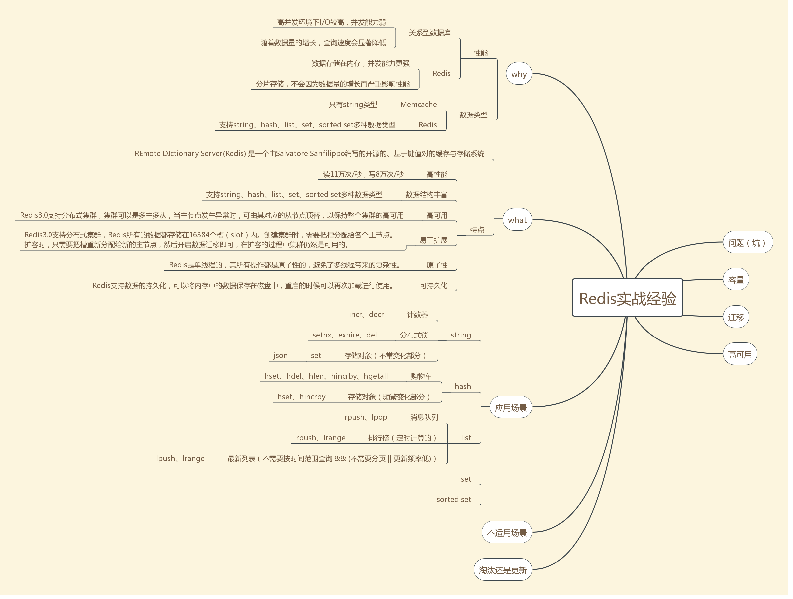

[list类型的应用场景 —— Redis实战经验](https://www.cnblogs.com/pangzizhe/p/10674501.html) 参考博客


 list类型是简单的字符串列表，按照插入顺序排序。每个列表最多可以存储 232 - 1 个元素（40多亿） 。

## 应用场景

　　1. 消息队列

　　list类型的lpop和rpush（或者反过来，lpush和rpop）能实现队列的功能，故而可以用Redis的list类型实现简单的点对点的消息队列。不过我不推荐在实战中这么使用，因为现在已经有Kafka、NSQ、RabbitMQ等成熟的消息队列了，它们的功能已经很完善了，除非是为了更深入地理解消息队列，不然我觉得没必要去重复造轮子。

　　2. 排行榜

　　list类型的lrange命令可以分页查看队列中的数据。可将每隔一段时间计算一次的排行榜存储在list类型中，如京东每日的手机销量排行、学校每次月考学生的成绩排名、斗鱼年终盛典主播排名等，下图是酷狗音乐“K歌擂台赛”的昨日打擂金曲排行榜，每日计算一次，存储在list类型中，接口访问时，通过page和size分页获取打擂金曲。（打个小广告，酷狗音乐“K歌擂台赛”每天都能产生一批优质翻唱作品，对普通人优质歌声有兴趣的朋友不妨来听听）。　　　

　　但是，并不是所有的排行榜都能用list类型实现，只有定时计算的排行榜才适合使用list类型存储，与定时计算的排行榜相对应的是实时计算的排行榜，list类型不能支持实时计算的排行榜，之后在介绍有序集合sorted set的应用场景时会详细介绍实时计算的排行榜的实现。

　　3. 最新列表

　　list类型的lpush命令和lrange命令能实现最新列表的功能，每次通过lpush命令往列表里插入新的元素，然后通过lrange命令读取最新的元素列表，如朋友圈的点赞列表、评论列表。

　　但是，并不是所有的最新列表都能用list类型实现，因为对于频繁更新的列表，list类型的分页可能导致列表元素重复或漏掉，举个例子，当前列表里由表头到表尾依次有（E，D，C，B，A）五个元素，每页获取3个元素，用户第一次获取到（E，D，C）三个元素，然后表头新增了一个元素F，列表变成了（F，E，D，C，B，A），此时用户取第二页拿到（C，B，A），元素C重复了。只有不需要分页（比如每次都只取列表的前5个元素）或者更新频率低（比如每天凌晨更新一次）的列表才适合用list类型实现。对于需要分页并且会频繁更新的列表，需用使用有序集合sorted set类型实现。另外，需要通过时间范围查找的最新列表，list类型也实现不了，也需要通过有序集合sorted set类型实现，如以成交时间范围作为条件来查询的订单列表。之后在介绍有序集合sorted set类型的应用场景时会详细介绍sorted set类型如何实现最新列表。

###### 那么问题来了，对于排行榜和最新列表两种应用场景，list类型能做到的sorted set类型都能做到，list类型做不到的sorted set类型也能做到，那为什么还要使用list类型去实现排行榜或最新列表呢，直接用sorted set类型不是更好吗？原因是sorted set类型占用的内存容量是list类型的数倍之多（之后会在容量章节详细介绍），对于列表数量不多的情况，可以用sorted set类型来实现，比如上文中举例的打擂金曲排行榜，每天全国只有一份，两种数据类型的内存容量差距可以忽略不计，但是如果要实现某首歌曲的翻唱作品地区排行榜，数百万的歌曲，300多个地区，会产生数量庞大的榜单，或者数量更加庞大的朋友圈点赞列表，就需要慎重地考虑容量的问题了。

## 存取

```
# 存
Lpush key value
# 取
LPOP key
RPOP key
```

[list类型的常用命令](http://www.runoob.com/redis/redis-lists.html)

加入list类型的应用场景后的思维导图如下  

### Redis 列表命令　

| 序号 | 命令及描述                                                   |
| :--- | :----------------------------------------------------------- |
| 1    | [BLPOP key1 [key2 \] timeout](https://www.runoob.com/redis/lists-blpop.html) 移出并获取列表的第一个元素， 如果列表没有元素会阻塞列表直到等待超时或发现可弹出元素为止。 |
| 2    | [BRPOP key1 [key2 \] timeout](https://www.runoob.com/redis/lists-brpop.html) 移出并获取列表的最后一个元素， 如果列表没有元素会阻塞列表直到等待超时或发现可弹出元素为止。 |
| 3    | [BRPOPLPUSH source destination timeout](https://www.runoob.com/redis/lists-brpoplpush.html) 从列表中弹出一个值，将弹出的元素插入到另外一个列表中并返回它； 如果列表没有元素会阻塞列表直到等待超时或发现可弹出元素为止。 |
| 4    | [LINDEX key index](https://www.runoob.com/redis/lists-lindex.html) 通过索引获取列表中的元素 |
| 5    | [LINSERT key BEFORE\|AFTER pivot value](https://www.runoob.com/redis/lists-linsert.html) 在列表的元素前或者后插入元素 |
| 6    | [LLEN key](https://www.runoob.com/redis/lists-llen.html) 获取列表长度 |
| 7    | [LPOP key](https://www.runoob.com/redis/lists-lpop.html) 移出并获取列表的第一个元素 |
| 8    | [LPUSH key value1 [value2\]](https://www.runoob.com/redis/lists-lpush.html) 将一个或多个值插入到列表头部 |
| 9    | [LPUSHX key value](https://www.runoob.com/redis/lists-lpushx.html) 将一个值插入到已存在的列表头部 |
| 10   | [LRANGE key start stop](https://www.runoob.com/redis/lists-lrange.html) 获取列表指定范围内的元素 |
| 11   | [LREM key count value](https://www.runoob.com/redis/lists-lrem.html) 移除列表元素 |
| 12   | [LSET key index value](https://www.runoob.com/redis/lists-lset.html) 通过索引设置列表元素的值 |
| 13   | [LTRIM key start stop](https://www.runoob.com/redis/lists-ltrim.html) 对一个列表进行修剪(trim)，就是说，让列表只保留指定区间内的元素，不在指定区间之内的元素都将被删除。 |
| 14   | [RPOP key](https://www.runoob.com/redis/lists-rpop.html) 移除列表的最后一个元素，返回值为移除的元素。 |
| 15   | [RPOPLPUSH source destination](https://www.runoob.com/redis/lists-rpoplpush.html) 移除列表的最后一个元素，并将该元素添加到另一个列表并返回 |
| 16   | [RPUSH key value1 [value2\]](https://www.runoob.com/redis/lists-rpush.html) 在列表中添加一个或多个值 |
| 17   | [RPUSHX key value](https://www.runoob.com/redis/lists-rpushx.html) 为已存在的列表添加值 |