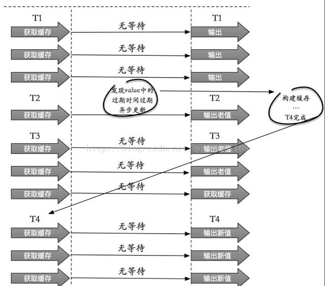
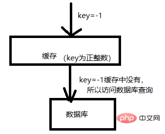

# 缓存雪崩

 如果缓存集中在一段时间内失效，发生大量的缓存穿透，所有的查询都落在数据库上，造成了缓存雪崩。

这个没有完美解决办法，但可以分析用户行为，尽量让失效时间点均匀分布。大多数系统设计者考虑用加锁或者队列的方式保证缓存的单线程（进程）写，从而避免失效时大量的并发请求落到底层存储系统上。

解决方法

#### 加锁排队. 限流-- 限流算法.

-  计数 
- 滑动窗口 
- 令牌桶[Token Bucket](http://www.baidu.com/link?url=RCRIj-E3Zno0Bgk2UOgMlWL9rCHBbbq_xVB1rt9Xm9YMyF9p639u9fyAGNGk0WU4F1zQWCJbFXIRMiTMnTTUydywKQ4R6Iv39PcykpVw5fzfBfJLcHajuPdZgswlRtqT) 
- 漏桶 leaky bucket 

在缓存失效后，通过加锁或者队列来控制读数据库写缓存的线程数量。比如对某个key只允许一个线程查询数据和写缓存，其他线程等待。

业界比较常用的做法，是使用mutex。简单地来说，就是在缓存失效的时候（判断拿出来的值为空），不是立即去load db，而是先使用缓存工具的某些带成功操作返回值的操作（比如[Redis](http://lib.csdn.net/base/redis)的SETNX或者Memcache的ADD）去set一个mutex key，当操作返回成功时，再进行load db的操作并回设缓存；否则，就重试整个get缓存的方法。  

SETNX，是「SET if Not eXists」的缩写，也就是只有不存在的时候才设置，可以利用它来实现锁的效果。

#### 数据预热

可以通过缓存reload机制，预先去更新缓存，再即将发生大并发访问前手动触发加载缓存不同的key，设置不同的过期时间，让缓存失效的时间点尽量均匀

#### 做二级缓存，或者双缓存策略

   A1为原始缓存，A2为拷贝缓存，A1失效时，可以访问A2，A1缓存失效时间设置为短期，A2设置为长期。

#### 缓存永远不过期

 这里的“永远不过期”包含两层意思：

  (1) 从缓存上看，确实没有设置过期时间，这就保证了，不会出现热点key过期问题，也就是“物理”不过期。

   (2) 从功能上看，如果不过期，那不就成静态的了吗？所以我们把过期时间存在key对应的value里，如果发现要过期了，通过一个后台的异步线程进行缓存的构建，也就是“逻辑”过期.

 从实战看，这种方法对于性能非常友好，唯一不足的就是构建缓存时候，其余线程(非构建缓存的线程)可能访问的是老数据，但是对于一般的互联网功能来说这个还是可以忍受。

[缓存穿透、缓存击穿、缓存雪崩区别和解决方案]( https://blog.csdn.net/kongtiao5/article/details/82771694 )  参考博客

# [缓存穿透的原理]( https://m.php.cn/redis/423813.html )

缓存穿透是指查询一个一定不存在的数据，由于缓存是不命中时需要从[数据库](http://lib.csdn.net/base/mysql)查询，查不到数据则不写入缓存，这将导致这个不存在的数据每次请求都要到数据库去查询，造成缓存穿透。

缓存的正常使用如图：

如图所示，缓存的使用流程：

1、先从缓存中取数据，如果能取到，则直接返回数据给用户。这样不用访问数据库，减轻数据库的压力。

2、如果缓存中没有数据，就会访问数据库。

这里面就会存在一个BUG，如图：

如图，缓存就像是数据库的一道防火墙，将请求比较频繁的数据放到缓存中，从而减轻数据库的压力。 但是如果有人恶意攻击，那就很轻松的穿透你的缓存，将所有的压力都给数据库。比如上图，你缓存的key都是正整数，但是我偏偏使用负数作为key访问你的缓存，这样就会导致穿透缓存，将压力直接给数据库。

## 导致缓存穿透的原因

缓存穿透的问题，肯定是在大并发情况下。依此为前提，我们分析缓存穿透的原因如下：

> 恶意攻击，猜测你的key命名方式，然后估计使用一个你缓存中不会有的key进行访问。
>
> 第一次数据访问，这时缓存中还没有数据，则并发场景下，所有的请求都会压到数据库。
>
> 数据库的数据也是空，这样即使访问了数据库，也是获取不到数据，那么缓存中肯定也没有对应的数据。这样也会导致穿透。

## 解决缓存穿透

缓存穿透在于一步步规避穿透的原因，如图：

如上图所示，解决的步骤如下：

> - 1、再web服务器启动时，提前将有可能被频繁并发访问的数据写入缓存。—这样就规避大量的请求在第3步出现排队阻塞。
>
> - 2、规范key的命名，并且统一缓存查询和写入的入口。这样，在入口处，对key的规范进行检测。–这样保存恶意的key被拦截。
>
> - 3、Synchronized双重检测机制，这时我们就需要使用同步（Synchronized）机制，在同步代码块前查询一下缓存是否存在对应的key，然后同步代码块里面再次查询缓存里是否有要查询的key。 这样“双重检测”的目的，还是避免并发场景下导致的没有意义的数据库的访问（也是一种严格避免穿透的方案）。
>
>   这一步会导致排队，但是第一步中我们说过，为了避免大量的排队，可以提前将可以预知的大量请求提前写入缓存。
>
> - 4、不管数据库中是否有数据，都在缓存中保存对应的key，值为空就行。–这样是为了避免数据库中没有这个数据，导致的频繁穿透缓存对数据库进行访问。
>
> - 5、第4步中的空值如果太多，也会导致内存耗尽。导致不必要的内存消耗。这样就要定期的清理空值的key。避免内存被恶意占满。导致正常的功能不能缓存数据。

#### 1.布隆过滤

对所有可能查询的参数以hash形式存储，在控制层先进行校验，不符合则丢弃。还有最常见的则是采用布隆过滤器，将所有可能存在的数据哈希到一个足够大的bitmap中，一个一定不存在的数据会被这个bitmap拦截掉，从而避免了对底层存储系统的查询压力。

 补充:

   Bloom filter

适用范围：可以用来实现数据字典，进行数据的判重，或者集合求交集

基本原理及要点：对于原理来说很简单，位数组+k个独立hash函数。将hash函数对应的值的位数组置1，查找时如果发现所有hash函数对应位都是1说明存在，很明显这个过程并不保证查找的结果是100%正确的。同时也不支持删除一个已经插入的关键字，因为该关键字对应的位会牵动到其他的关键字。所以一个简单的改进就是counting Bloom filter，用一个counter数组代替位数组，就可以支持删除了。添加时增加计数器，删除时减少计数器。

#### 2.缓存空对象. 将 null 变成一个值.

 也可以采用一个更为简单粗暴的方法，如果一个查询返回的数据为空（不管是数 据不存在，还是系统故障），我们仍然把这个空结果进行缓存，但它的过期时间会很短，最长不超过五分钟。

 缓存空对象会有两个问题：

 第一，空值做了缓存，意味着缓存层中存了更多的键，需要更多的内存空间 ( 如果是攻击，问题更严重 )，比较有效的方法是针对这类数据设置一个较短的过期时间，让其自动剔除。

建议空值放在另外的缓存空间中，不宜与正常值共用空间，否则当空间不足时，缓存系统的LRU算法可能会先剔除正常值，再剔除空值——这个漏洞可能会受到攻击。

 第二，缓存层和存储层的数据会有一段时间窗口的不一致，可能会对业务有一定影响。例如过期时间设置为 5分钟，如果此时存储层添加了这个数据，那此段时间就会出现缓存层和存储层数据的不一致，此时可以利用消息系统或者其他方式清除掉缓存层中的空对象。

如果是Redis缓存，更新数据后直接在Redis中清除即可；如果是本地缓存，就需要用消息来通知其他机器清除各自的本地缓存了。

接口层增加校验，如用户鉴权校验，id做基础校验，id<=0的直接拦截；
从缓存取不到的数据，在数据库中也没有取到，这时也可以将key-value对写为key-null，缓存有效时间可以设置短点，如30秒（设置太长会导致正常情况也没法使用）。这样可以防止攻击用户反复用同一个id暴力攻击

# 热点key

### 描述

缓存中的某些Key(可能对应用与某个促销商品)对应的value存储在集群中一台机器，使得所有流量涌向同一机器，成为系统的瓶颈，该问题的挑战在于它无法通过增加机器容量来解决。

### 解决方案：

客户端热点key缓存：将热点key对应value并缓存在客户端本地，并且设置一个失效时间。对于每次读请求，将首先检查key是否存在于本地缓存中，如果存在则直接返回，如果不存在再去访问分布式缓存的机器。
将热点key分散为多个子key，然后存储到缓存集群的不同机器上，这些子key对应的value都和热点key是一样的。当通过热点key去查询数据时，通过某种hash算法随机选择一个子key，然后再去访问缓存机器，将热点分散到了多个子key上。