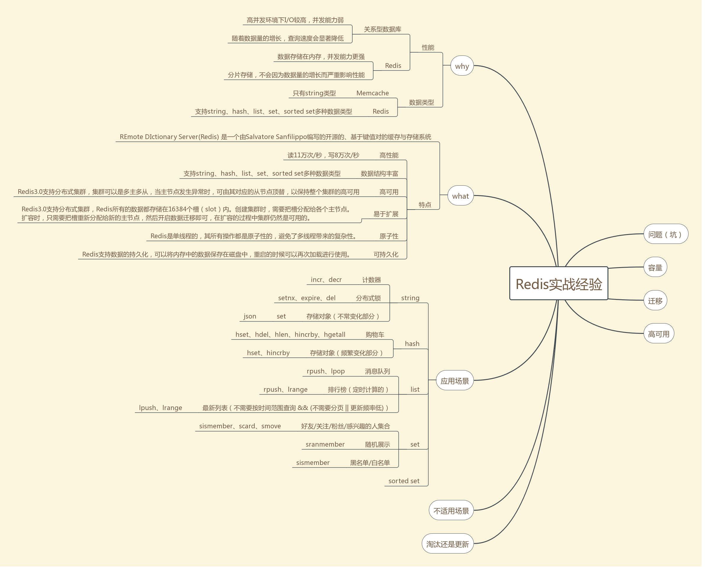

[set类型的应用场景 —— Redis实战经验](https://www.cnblogs.com/pangzizhe/p/10723019.html)参考博客


 set类型是string类型的集合，其特点是集合元素无序且不重复，每个集合最多可以存储 232 - 1 个元素（40多亿）。

## 应用场景

　　1. 好友/关注/粉丝/感兴趣的人集合

　　set类型唯一的特点使得其适合用于存储好友/关注/粉丝/感兴趣的人集合，集合中的元素数量可能很多，每次全部取出来成本不小，set类型提供了一些很实用的命令用于直接操作这些集合，如

​			a. sinter命令可以获得A和B两个用户的共同好友

​			b. sismember命令可以判断A是否是B的好友

​			c. scard命令可以获取好友数量

 			c. 关注时，smove命令可以将B从A的粉丝集合转移到A的好友集合

　　需要注意的是，如果你用的是Redis Cluster集群，对于sinter、smove这种操作多个key的命令，要求这两个key必须存储在同一个slot（槽位）中，否则会报出 (error) CROSSSLOT Keys in request don't hash to the same slot 错误。Redis Cluster一共有16384个slot，每个key都是通过哈希算法CRC16(key)获取数值哈希，再模16384来定位slot的。要使得两个key处于同一slot，除了两个key一模一样，还有没有别的方法呢？答案是肯定的，Redis提供了一种**Hash Tag**的功能，在key中使用{}括起key中的一部分，在进行 CRC16(key) mod 16384 的过程中，只会对{}内的字符串计算，例如friend_set:{123456}和fans_set:{123456}，分别表示用户123456的好友集合和粉丝集合，在定位slot时，只对{}内的123456进行计算，所以这两个集合肯定是在同一个slot内的，当用户123456关注某个粉丝时，就可以通过smove命令将这个粉丝从用户123456的粉丝集合移动到好友集合。相比于通过srem命令先将这个粉丝从粉丝集合中删除，再通过sadd命令将这个粉丝加到好友集合，smove命令的优势是它是原子性的，不会出现这个粉丝从粉丝集合中被删除，却没有加到好友集合的情况。然而，对于通过sinter获取共同好友而言，Hash Tag则无能为力，例如，要用sinter去获取用户123456和456789两个用户的共同好友，除非我们将key定义为{friend_set}:123456和{friend_set}:456789，否则不能保证两个key会处于同一个slot，但是如果真这样做的话，所有用户的好友集合都会堆积在同一个slot中，数据分布会严重不均匀，不可取，所以，在实战中使用Redis Cluster时，sinter这个命令其实是不适合作用于两个不同用户对应的集合的（同理其它操作多个key的命令）。

　　2. 随机展示

　　通常，app首页的展示区域有限，但是又不能总是展示固定的内容，一种做法是先确定一批需要展示的内容，再从中随机获取。如下图所示，酷狗音乐K歌擂台赛当日的打擂歌曲共29首，首页随机展示5首；昨日打擂金曲共200首，首页随机展示30首。

　　set类型适合存放所有需要展示的内容，而srandmember命令则可以从中随机获取几个。

　　3. 黑名单/白名单

　　经常有业务出于安全性方面的考虑，需要设置用户黑名单、ip黑名单、设备黑名单等，set类型适合存储这些黑名单数据，sismember命令可用于判断用户、ip、设备是否处于黑名单之中。

### 存取

```
# 存
SADD key value
# 取
SMEMBERS key
```

　　[set类型的常用命令可参考](http://www.runoob.com/redis/redis-sets.html)

　　加入set类型的应用场景后的思维导图如下　

### Redis 集合命令

下表列出了 Redis 集合基本命令：

| 序号 | 命令及描述                                                   |
| :--- | :----------------------------------------------------------- |
| 1    | [SADD key member1 [member2\]](https://www.runoob.com/redis/sets-sadd.html) 向集合添加一个或多个成员 |
| 2    | [SCARD key](https://www.runoob.com/redis/sets-scard.html) 获取集合的成员数 |
| 3    | [SDIFF key1 [key2\]](https://www.runoob.com/redis/sets-sdiff.html) 返回给定所有集合的差集 |
| 4    | [SDIFFSTORE destination key1 [key2\]](https://www.runoob.com/redis/sets-sdiffstore.html) 返回给定所有集合的差集并存储在 destination 中 |
| 5    | [SINTER key1 [key2\]](https://www.runoob.com/redis/sets-sinter.html) 返回给定所有集合的交集 |
| 6    | [SINTERSTORE destination key1 [key2\]](https://www.runoob.com/redis/sets-sinterstore.html) 返回给定所有集合的交集并存储在 destination 中 |
| 7    | [SISMEMBER key member](https://www.runoob.com/redis/sets-sismember.html) 判断 member 元素是否是集合 key 的成员 |
| 8    | [SMEMBERS key](https://www.runoob.com/redis/sets-smembers.html) 返回集合中的所有成员 |
| 9    | [SMOVE source destination member](https://www.runoob.com/redis/sets-smove.html) 将 member 元素从 source 集合移动到 destination 集合 |
| 10   | [SPOP key](https://www.runoob.com/redis/sets-spop.html) 移除并返回集合中的一个随机元素 |
| 11   | [SRANDMEMBER key [count\]](https://www.runoob.com/redis/sets-srandmember.html) 返回集合中一个或多个随机数 |
| 12   | [SREM key member1 [member2\]](https://www.runoob.com/redis/sets-srem.html) 移除集合中一个或多个成员 |
| 13   | [SUNION key1 [key2\]](https://www.runoob.com/redis/sets-sunion.html) 返回所有给定集合的并集 |
| 14   | [SUNIONSTORE destination key1 [key2\]](https://www.runoob.com/redis/sets-sunionstore.html) 所有给定集合的并集存储在 destination 集合中 |
| 15   | [SSCAN key cursor [MATCH pattern\] [COUNT count]](https://www.runoob.com/redis/sets-sscan.html) 迭代集合中的元素 |