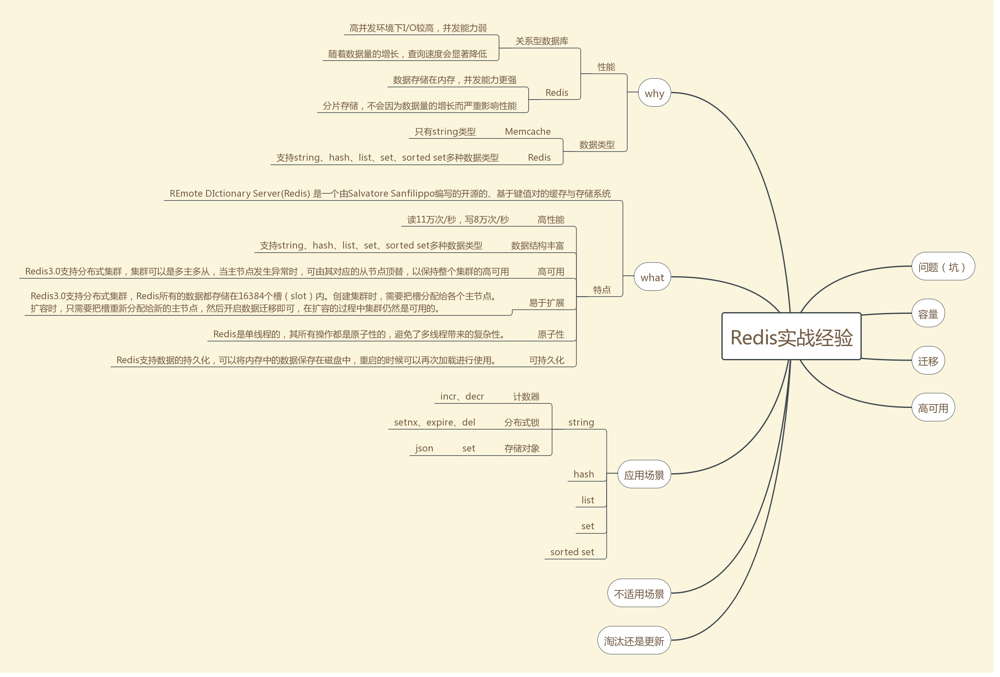

[string类型的应用场景 —— Redis实战经验](https://www.cnblogs.com/pangzizhe/p/10655248.html)  参考博客

string类型是实战中应用最多的数据类型，Redis的一些特性决定了string类型的应用场景。

#### Redis的数据是共享的

　　如果将用户信息存储在web服务的本地缓存，则每个web服务都会缓存一份，当用户修改昵称时，需要通知其它web服务更新用户缓存。

　　如果将用户信息存储在Redis，则只有一份缓存，所有的web访问的都是同一份缓存，当用户修改昵称时，所有web服务都能同时访问到最新的缓存。

#### Redis是单线程的

　　由于Redis的性能瓶颈在于内存读写速度，而不是CPU，设计者将Redis设计成了单线程模式，其所有操作都是原子性的，避免了多线程带来的复杂性。

###  存取

```
# 存
SET key value
# 取
GET key
```

### 应用场景

1. 计数器

　　string类型的incr和decr命令的作用是将key中储存的数字值加一/减一，这两个操作具有原子性，总能安全地进行加减操作，因此可以用string类型进行计数，如微博的评论数、点赞数、分享数，抖音作品的收藏数，京东商品的销售量、评价数等。

​			2.分布式锁

　　string类型的setnx的作用是“当key不存在时，设值并返回1，当key已经存在时，不设值并返回0”，“判断key是否存在”和“设值”两个操作是原子性地执行的，因此可以用string类型作为分布式锁，返回1表示获得锁，返回0表示没有获得锁。例如，为了保证定时任务的高可用，往往会同时部署多个具备相同定时任务的服务，但是业务上只希望其中的某一台服务执行定时任务，当定时任务的时间点触发时，多个服务同时竞争一个分布式锁，获取到锁的执行定时任务，没获取到的放弃执行定时任务。定时任务执行完时通过del命令删除key即释放锁，如果担心del命令操作失败而导致锁一直未释放，可以通过expire命令给锁设置一个合理的自动过期时间，确保即使del命令失败，锁也能被释放。不过expire命令同样存在失败的可能性。

　　3. 存储对象

　　利用JSON强大的兼容性、可读性和易用性，将对象转换为JSON字符串，再存储在string类型中，是个不错的选择，如用户信息、商品信息等。 

 

### Redis 字符串命令

| 序号 | 命令及描述                                                   |
| :--- | :----------------------------------------------------------- |
| 1    | [SET key value](https://www.runoob.com/redis/strings-set.html) 设置指定 key 的值 |
| 2    | [GET key](https://www.runoob.com/redis/strings-get.html) 获取指定 key 的值。 |
| 3    | [GETRANGE key start end](https://www.runoob.com/redis/strings-getrange.html) 返回 key 中字符串值的子字符 |
| 4    | [GETSET key value](https://www.runoob.com/redis/strings-getset.html) 将给定 key 的值设为 value ，并返回 key 的旧值(old value)。 |
| 5    | [GETBIT key offset](https://www.runoob.com/redis/strings-getbit.html) 对 key 所储存的字符串值，获取指定偏移量上的位(bit)。 |
| 6    | [MGET key1 [key2..\]](https://www.runoob.com/redis/strings-mget.html) 获取所有(一个或多个)给定 key 的值。 |
| 7    | [SETBIT key offset value](https://www.runoob.com/redis/strings-setbit.html) 对 key 所储存的字符串值，设置或清除指定偏移量上的位(bit)。 |
| 8    | [SETEX key seconds value](https://www.runoob.com/redis/strings-setex.html) 将值 value 关联到 key ，并将 key 的过期时间设为 seconds (以秒为单位)。 |
| 9    | [SETNX key value](https://www.runoob.com/redis/strings-setnx.html) 只有在 key 不存在时设置 key 的值。 |
| 10   | [SETRANGE key offset value](https://www.runoob.com/redis/strings-setrange.html) 用 value 参数覆写给定 key 所储存的字符串值，从偏移量 offset 开始。 |
| 11   | [STRLEN key](https://www.runoob.com/redis/strings-strlen.html) 返回 key 所储存的字符串值的长度。 |
| 12   | [MSET key value [key value ...\]](https://www.runoob.com/redis/strings-mset.html) 同时设置一个或多个 key-value 对。 |
| 13   | [MSETNX key value [key value ...\]](https://www.runoob.com/redis/strings-msetnx.html) 同时设置一个或多个 key-value 对，当且仅当所有给定 key 都不存在。 |
| 14   | [PSETEX key milliseconds value](https://www.runoob.com/redis/strings-psetex.html) 这个命令和 SETEX 命令相似，但它以毫秒为单位设置 key 的生存时间，而不是像 SETEX 命令那样，以秒为单位。 |
| 15   | [INCR key](https://www.runoob.com/redis/strings-incr.html) 将 key 中储存的数字值增一。 |
| 16   | [INCRBY key increment](https://www.runoob.com/redis/strings-incrby.html) 将 key 所储存的值加上给定的增量值（increment） 。 |
| 17   | [INCRBYFLOAT key increment](https://www.runoob.com/redis/strings-incrbyfloat.html) 将 key 所储存的值加上给定的浮点增量值（increment） 。 |
| 18   | [DECR key](https://www.runoob.com/redis/strings-decr.html) 将 key 中储存的数字值减一。 |
| 19   | [DECRBY key decrement](https://www.runoob.com/redis/strings-decrby.html) key 所储存的值减去给定的减量值（decrement） 。 |
| 20   | [APPEND key value](https://www.runoob.com/redis/strings-append.html) 如果 key 已经存在并且是一个字符串， APPEND 命令将指定的 value 追加到该 key 原来值（value）的末尾。 |