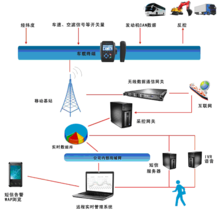
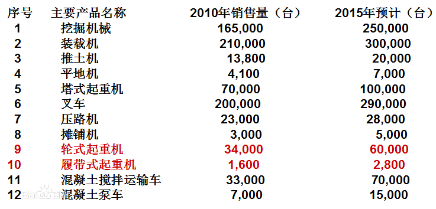

车联网系统

## 定义

[车联网](https://baike.baidu.com/item/%E8%BD%A6%E8%81%94%E7%BD%91)系统，是指通过在车辆仪表台安装车载终端设备，实现对车辆所有工作情况和静、动态信息的采集、存储并发送。车联网系统一般具有实时实景功能，利用移动网络实现人车交互。

系统分为三大部分：车载终端、云计算处理[平台](https://baike.baidu.com/item/%E5%B9%B3%E5%8F%B0)、[数据](https://baike.baidu.com/item/%E6%95%B0%E6%8D%AE/33305)分析平台，根据不同行业对车辆的不同的功能需求实现对车辆有效监控管理。车辆的运行往往涉及多项开关量、传感器模拟量、[CAN](https://baike.baidu.com/item/CAN/62765)信号数据等等，驾驶员在操作车辆运行过程中，产生的车辆数据不断回发到后台数据库，形成[海量数据](https://baike.baidu.com/item/%E6%B5%B7%E9%87%8F%E6%95%B0%E6%8D%AE)，由云计算平台实现对数据的“过滤清洗”，数据分析平台对数据进行报表式处理，供管理人员查看。

## 背景

2010年10月28日，第一届中国国际[物联网](https://baike.baidu.com/item/%E7%89%A9%E8%81%94%E7%BD%91)（传感网）大会上传来消息，汽车移动物联网（[车联网](https://baike.baidu.com/item/%E8%BD%A6%E8%81%94%E7%BD%91)）项目将被列为国家重大专项第三专项中的重要项目。目前相关内容已上报国务院，一期拨款有望达百亿级别，预期2020年实现可控车辆规模达2亿。

## 简介

车联网系统分为三大部分：[车载终端](https://baike.baidu.com/item/%E8%BD%A6%E8%BD%BD%E7%BB%88%E7%AB%AF)、云计算处理平台、数据分析平台。车载终端采集车辆实时运行数据，实现对车辆所有工作信息和静、动态信息的采集、存储并发送。车载终端由[传感器](https://baike.baidu.com/item/%E4%BC%A0%E6%84%9F%E5%99%A8/26757)、[数据采集器](https://baike.baidu.com/item/%E6%95%B0%E6%8D%AE%E9%87%87%E9%9B%86%E5%99%A8)、无线发送模块组成，车辆实时运行工况包括驾驶员的操作行为、动力系统工作参数数据等；由云计算处理平台处理车辆信息，对数据进行“过滤清洗”；数据分析平台则负责对数据进行报表式处理，供管理人员查看。

[中国物联网校企联盟](https://baike.baidu.com/item/%E4%B8%AD%E5%9B%BD%E7%89%A9%E8%81%94%E7%BD%91%E6%A0%A1%E4%BC%81%E8%81%94%E7%9B%9F)认为：未来的车联网系统可以使感知更加透彻，除了道路状况外，还可以感知各种各样的要素——污染指数、紫外线强度、天气状况、附近加油站……同时还可以感知驾驶员的身体状况、驾驶水平、出行目的……路线的不再是“快速到达目的地”，而是“最适合驾驶员，最适合这次出行”，汽车导航将由“以路为本”变为“以人为本”。

## 概念

### ITS

即智能交通。将先进的[传感器技术](https://baike.baidu.com/item/%E4%BC%A0%E6%84%9F%E5%99%A8%E6%8A%80%E6%9C%AF)、通信技术、数据处理技术、[网络技术](https://baike.baidu.com/item/%E7%BD%91%E7%BB%9C%E6%8A%80%E6%9C%AF)、[自动控制技术](https://baike.baidu.com/item/%E8%87%AA%E5%8A%A8%E6%8E%A7%E5%88%B6%E6%8A%80%E6%9C%AF)、信息发布技术等有机运用于整个交通运输管理体系而建立起的一种实时的、准确的、高效的交通运输综合管理和控制系统。

### CAN

CAN是控制器局域网络（Controller Area Network，CAN）的简称，是由研发和生产汽车电子产品著称的德国BOSCH公司开发了的，并最终成为国际标准。是国际上应用最广泛的现场总线之一。在北美和西欧，CAN总线协议已经成为[汽车计算机控制系统](https://baike.baidu.com/item/%E6%B1%BD%E8%BD%A6%E8%AE%A1%E7%AE%97%E6%9C%BA%E6%8E%A7%E5%88%B6%E7%B3%BB%E7%BB%9F)和嵌入式工业控制局域网的标准总线，并且拥有以CAN为底层协议专为大型货车和重工机械车辆设计的J1939协议。近年来，其所具有的高可靠性和良好的错误检测能力受到重视，被广泛应用于汽车计算机控制系统和环境温度恶劣、电磁辐射强和振动大的工业环境。

## 车联网应用

国际车联网现状

车辆运行监控系统长久以来都是智能[交通](https://baike.baidu.com/item/交通/30183)发展的重点领域。在国际上，美国的IVHS、日本的VICS等系统通过车辆和道路之间建立有效的信息通信，已经实现了智能交通的管理和信息服务。而Wi-Fi、RFID等无线技术近年来也在交通运输领域智能化管理中得到了应用，如在智能公交定位管理和信号优先、智能停车场管理、车辆类型及流量信息采集、[路桥](https://baike.baidu.com/item/路桥)电子不停车收费及车辆速度计算分析等方面取得了一定的应用成效。

当今车联网系统发展主要通过传感器技术、无线传输技术、数据处理技术、数据整合技术相辅相成配合实现。车联网系统的未来，将会面临系统功能集成化、数据海量化、高传输速率。车载终端集成车辆仪表台电子设备，如硬盘播放、收音机等，数据采集也会面临多路视频输出要求，因此对于影像数据的传输，需要广泛运用当今流行3G网络。 

国内车联网现状

**杭州鸿泉与金龙客车**

目前，金龙客车已经通过与[杭州鸿泉数字设备有限公司](https://baike.baidu.com/item/杭州鸿泉数字设备有限公司)合作，在车辆出厂前安装车载终端设备采集车辆运行状况数据和司机驾驶行为，如今，由杭州鸿泉公司研发，金龙客车使用的G-BOS系统已经管理车辆60000多台，但当用户数量大幅增加时，数据传输、过滤、存储及显示也一直在承受相当大的考验。2012年3月11日，基于云计算的第三代车联网云计算解决方案鸿泉云网正式投入使用，设计最低可以支持30万终端同时在线（理论上云计算可支持无数终端）。

**杭州鸿泉与陕汽重卡**

2011年12月18日，[杭州鸿泉数字设备有限公司](https://baike.baidu.com/item/杭州鸿泉数字设备有限公司)与[陕汽](https://baike.baidu.com/item/陕汽)联合研发的[天行健车联网服务系统](https://baike.baidu.com/item/天行健车联网服务系统)正式发布。成为重卡行业率先使用车联网技术的公司，具有开创性意义。近日，国家交通部道路运输司副司长[徐亚华](https://baike.baidu.com/item/徐亚华)和车辆处处长俞卫江等部委领导先后莅临陕汽视察工作，对“天行健”车联网系统进行了详细的了解，在得知“天行健”研发完全立足于重卡客户的[潜在服务](https://baike.baidu.com/item/潜在服务)需求，核心功能兼具创新性和实用性后，徐副司长明确指出：“天行健[车联网](https://baike.baidu.com/item/车联网)服务系统”是陕汽紧跟车联网技术发展以及国家关于建设道路交管平台要求的创新性产品，将会对重卡行业服务和公路交通安全的提升起到非常大的促进作用，督促相关部门给予“天行健”大力的支持，并鼓励陕汽不断对“天行健”产品进行完善，保证产品可以持续满足重卡用户和公路交通安全监管需求。

此外，当今比较优秀车联网系统有瑞典SCANIA的黑匣子系统，杭州鸿泉的车辆移动互联网（车联网）系统，台湾和欣客运远程管理系统，潍柴动力的共轨行系统，江苏天泽的天泽星网。

以杭州鸿泉数字设备有限公司的车辆移动互联网（车联网）系统，该系统曾为苏州金龙公司服务，即曾在客车行业久负盛名的G-BOS智慧运营系统，该系统从去年7月份正式发布，到今年已经管理车辆将近60000多部。

自该系统在客车行业得到成功运用后，鸿泉数字设备又将在客车行业的管理经验复制到工程机械车辆、卡车等货运车辆行业。

## 机遇与挑战

### 机遇

第一方面，市场空间大。国内无论是汽车的保有量还是销售量，都已经位于世界的前列，一些豪华奢侈品牌都把所谓的基地总部迁到了中国。基于车辆的车联网市场容量是巨大的，但目前的国内车联网刚刚起步，尤其是前装市场。整车企业在刚刚建设车联网相关的服务内容，国内的车联网用户非常少，但随着市场的推广和用户认知度的提高，在三年时间内车联网就会发生爆炸式增长，用户规模不会小于1千万，而且用户量还会保持激增的状态。

第二方面，更接近用户。谁最接近用户、厂商、4S店，所有为汽车服务、靠汽车赚钱的人最接近用户。汽车产业链比较固化，用户的行为、体验、车况等信息对厂商来说非常有价值，而且还会衍生出其他的增值服务，车联网会逐渐成为汽车厂商和用户之间的桥梁纽带。

第三方面，为厂商赢得话语权。目前汽车品牌产品的同质化现象非常严重，比如一个四驱SUV，各个品牌都差不多。一个紧凑型的经济型轿车也都差不多，甚至包括外型。厂商要思考如何通过差异化来提升产品的价值，从而吸引消费者。其他方面能发挥的已经非常少了，汽车制造业是非常成熟的产业，但车联网是可发挥的巨大空间。

第四方面，云加端的模式给厂商和价值链上的供应商节省成本。汽车厂商是造车的，无论是对移动互联网的理解，还是在应用软件的开发上，都是欠缺经验的。刚好云加端这种方式给他们提供了很好的解决方案，利用云技术还能够降低成本。

### 挑战

**四大难题亟待解决**

首先是支付问题。移动支付日趋主流化，人们喜欢在网上商城购物。中国移动和银联合作推NFC的中低端手机，今年可能会在国内预装5千万部，未来短距离的接触一定会成为主流。 

其次是网络环境问题。尽管北京的移动网络覆盖已经不错了，可信号还是差强人意。对于车联网来说，互联网是必不可缺的。现在的网络环境对于车联网来说，还是不能完全满足。

再次是定位的安全和隐私。大部分的车联网服务都和位置相关，都是LBS服务。车辆定位是基础，但是这个位置和手机号，和mail、微信等通讯产品一样，也是隐私之一，需要国家的立法才能变得顺利起来。

最后是技术问题。根据车联网的技术问题，国内与国外相比还是存在一定差距。涉及这个方面的技术企业和开发者不多，做得也不够成熟。随着车联网的市场规模越来越大、技术的突破，未来中国的车联网技术在全世界领先也不是没有可能的。

## 意义

车联网系统可以采集并保存设备运行数据，当车辆发生故障并引起客户损失时，可以用数据平息双方的争端，并帮助车辆驾驶员避免重复不规范的错误操作，用户对系统的应用点总结如下：

产品的全生命周期管理（PLM）

通过对车辆的工况的数据采集和实时传输，生产厂家可以对自己的产品进行全生命周期的管理，也就是说一台车辆从走出厂门那天开始，所有的运行数据都会发回到生产厂家的“企业参数中心”，非常方便生成各种分析报告，为以后的新产品的研发提供决策支持。

通过远程数据采集和分析提高产品使用寿命

通过远程管理系统，可以采集到用户的使用习惯，除了给用户提供分析报告以外，也可以及时纠正用户的不良使用习惯，以延长产品的使用寿命。

节能减排

该系统会自动监测各重要部件的工况，有异常情况可以及通知用户及厂家，以避免因动力系统等重要部件异常而引起不必要的高油耗，同时通过用户使用习惯的报告，也可以避免不良使用习惯而引起的高油耗。

远程管理

对于分期付款的用户，如果货款回收困难，可以通过远程锁机等手段控制设备，也可以通过GPS定位查找设备位置，以帮助追讨欠款。

远程诊断及维护

通过远程管理系统，可以降低维护人员的成本，远程定位设备故障，简易的故障可以通过远程排除。

## 市场前景预测

目前比较成功车联网系统的运用以杭州鸿泉的车辆移动互联网（车联网）系统为例。

针对长期困扰着汽车运营商的各类核心问题所提出的关于“客车全生命周期管理”解决方案。分析系统通过安装在车辆上的终端，依托海量数据搜集、3G无线物联网络与智能远程控制为手段，结合智能化、电子化、信息化尖端技术缩成。为客车运营商实现“人”、“车”、“线”的智能整合管理，从根本上使客车运营商摆脱现存的“利润上不去、成本下不来”的运营窘境。

从去年7月份分析系统正式使用，到今年年初，通过分析系统管理的车辆已经达到10000多台，而且预计以后每年的管理车辆会以20000台的速度递增。

中国的汽车市场是一个庞大的市场，2010年全年销量为1806万辆，继续稳坐全球第一宝座，同比增长32.37%。产量为1826.47万辆，同比增长32.44%。

对于车辆经销商而言，车辆的实时监控是他们迫切的需求。分析系统存储车辆驾驶员的操作数据，分析驾驶员操作数据，并对驾驶习惯进行[数学建模](https://baike.baidu.com/item/数学建模)，给予每个驾驶员一个评分，从而起到警示教导的作用，督促驾驶员改善驾驶习惯，从而节省油耗并且延长车辆使用寿命。其次，基于[GPS](https://baike.baidu.com/item/GPS/214654)、[GPRS](https://baike.baidu.com/item/GPRS/107439)、[GIS](https://baike.baidu.com/item/GIS/31541)的三层应用，使得经销商对车辆的监控管理更是接近于完美。对于驾驶员而言，车辆运行数据的实时记录意味着黑匣子数据记录。一旦车辆出了事故，可通过查看系统对数据进行分析，确定到底是人的问题还是车的问题，有效解决售后纠纷。

在工程机械行业，“十二五”背景下提出的发展战略：推进我国工程机械产业由制造大国向制造强国的转变，初步形成具有国际前沿水平的主机产品、基础技术、功能部件的研发与制造体系，主要产品达到国际平均先进技术水平，实现我国工程机械产业由粗放型、模仿型、数量型向科技创新、质量、效益型的转变。

 “十二五”关于主要产品增量目标，如下图。 

